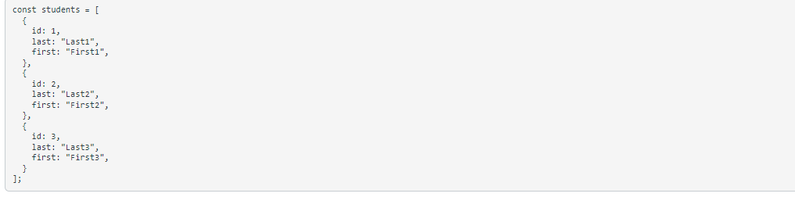

# Lab 5

Got experience using a new software called Postman, it is an application used for API testing. 

### Skills Used in Project
- Created an account with Postman
- Practice with Postmans interface, creating a query collection for CIT281
- Adding folders on Postman
- Using the GET route to return the following statements from this array:

### All Student

### Single Student 

